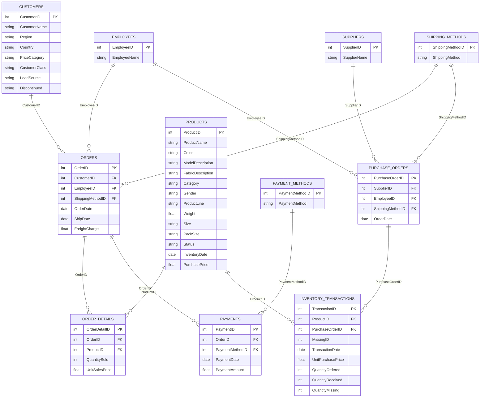

```mermaid
erDiagram
  CUSTOMERS ||--o{ ORDERS : "CustomerID"
  EMPLOYEES ||--o{ ORDERS : "EmployeeID"
  SHIPPING_METHODS ||--o{ ORDERS : "ShippingMethodID"

  ORDERS ||--o{ ORDER_DETAILS : "OrderID"
  PRODUCTS ||--o{ ORDER_DETAILS : "ProductID"

  ORDERS ||--o{ PAYMENTS : "OrderID"
  PAYMENT_METHODS ||--o{ PAYMENTS : "PaymentMethodID"

  SUPPLIERS ||--o{ PURCHASE_ORDERS : "SupplierID"
  EMPLOYEES ||--o{ PURCHASE_ORDERS : "EmployeeID"
  SHIPPING_METHODS ||--o{ PURCHASE_ORDERS : "ShippingMethodID"

  PURCHASE_ORDERS ||--o{ INVENTORY_TRANSACTIONS : "PurchaseOrderID"
  PRODUCTS ||--o{ INVENTORY_TRANSACTIONS : "ProductID"

  CUSTOMERS {
    int CustomerID PK
    string CustomerName
    string Region
    string Country
    string PriceCategory
    string CustomerClass
    string LeadSource
    string Discontinued
  }

  EMPLOYEES {
    int EmployeeID PK
    string EmployeeName
  }

  SHIPPING_METHODS {
    int ShippingMethodID PK
    string ShippingMethod
  }

  PAYMENT_METHODS {
    int PaymentMethodID PK
    string PaymentMethod
  }

  ORDERS {
    int OrderID PK
    int CustomerID FK
    int EmployeeID FK
    int ShippingMethodID FK
    date OrderDate
    date ShipDate
    float FreightCharge
  }

  ORDER_DETAILS {
    int OrderDetailID PK
    int OrderID FK
    int ProductID FK
    int QuantitySold
    float UnitSalesPrice
  }

  PAYMENTS {
    int PaymentID PK
    int OrderID FK
    int PaymentMethodID FK
    date PaymentDate
    float PaymentAmount
  }

  SUPPLIERS {
    int SupplierID PK
    string SupplierName
  }

  PURCHASE_ORDERS {
    int PurchaseOrderID PK
    int SupplierID FK
    int EmployeeID FK
    int ShippingMethodID FK
    date OrderDate
  }

  INVENTORY_TRANSACTIONS {
    int TransactionID PK
    int ProductID FK
    int PurchaseOrderID FK
    int MissingID
    date TransactionDate
    float UnitPurchasePrice
    int QuantityOrdered
    int QuantityReceived
    int QuantityMissing
  }

  PRODUCTS {
    int ProductID PK
    string ProductName
    string Color
    string ModelDescription
    string FabricDescription
    string Category
    string Gender
    string ProductLine
    float Weight
    string Size
    string PackSize
    string Status
    date InventoryDate
    float PurchasePrice
  }
```
