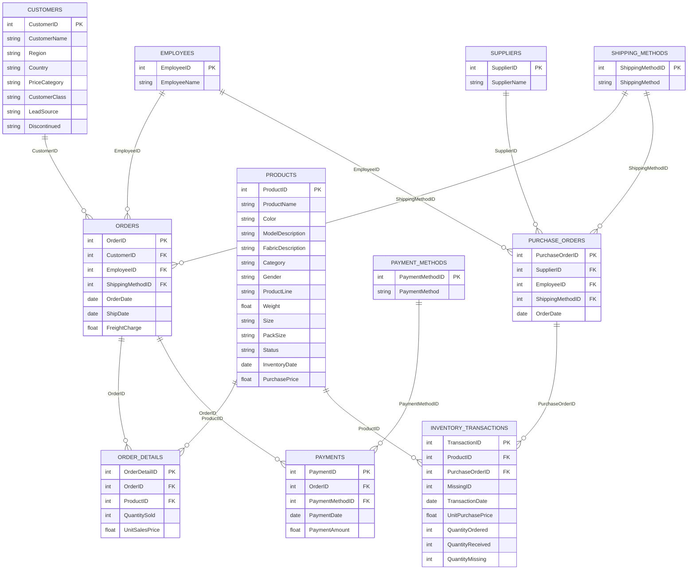

# ER Diagram — Full (As-is) — Underwear Dataset (11 Tables)

This document captures the dataset ER **as provided (as-is)**, plus a **Mermaid ER version** (text-based) so the diagram is reproducible and easy to review in PRs.

---

## 1) ER Diagram

---

## 2) ER Diagram (Mermaid — Reproducible)

> Paste this block into https://mermaid.live (or render in GitHub Markdown that supports Mermaid).

---

## 3) Tables Overview (Row Counts / “Weight”)

This helps readers interpret the ER quickly: **big tables** are event/transaction-heavy, while **small tables** are reference/lookup.

### A) Large / transactional (fact-like)
- `order_details` — **105,757**
- `inventory_transactions` — **20,951**
- `orders` — **2,286**
- `payments` — **686**

### B) Reference / lookup (dimension-like)
- `products` — **4,183** (mid-sized master table)
- `customers` — **225**
- `purchase_orders` — **232**
- `employees` — **15**
- `suppliers` — **2**
- `shipping_methods` — **4**
- `payment_methods` — **3**

> Source: `artifacts/scorecard.csv` (row_count)

---

## 4) Relationship List (As-is)

### Sales / Order-to-Cash
- `orders.customer_id` → `customers.customer_id`
- `orders.employee_id` → `employees.employee_id`
- `orders.shipping_method_id` → `shipping_methods.shipping_method_id`
- `order_details.order_id` → `orders.order_id`
- `order_details.product_id` → `products.product_id`
- `payments.order_id` → `orders.order_id`
- `payments.payment_method_id` → `payment_methods.payment_method_id`

### Procure / Purchase-to-Stock
- `purchase_orders.supplier_id` → `suppliers.supplier_id`
- `purchase_orders.employee_id` → `employees.employee_id`
- `purchase_orders.shipping_method_id` → `shipping_methods.shipping_method_id`
- `inventory_transactions.purchase_order_id` → `purchase_orders.purchase_order_id`
- `inventory_transactions.product_id` → `products.product_id`

---

## 4) Naming / Quoting Note (SQL Practicality)

The raw CSV uses **CamelCase** headers (e.g., `OrderID`). In PostgreSQL:
- unquoted identifiers are folded to lowercase
- therefore, referencing CamelCase columns requires **double quotes**: `"OrderID"`

This repo avoids that friction by exposing **`stg` views with normalized lowercase snake_case** (e.g., `order_id`), so all scorecard SQL stays clean.

### References
- ER image: `artifacts/diagrams/er_kaggle_as_is.png`
- Scorecard output: `artifacts/scorecard.csv`
