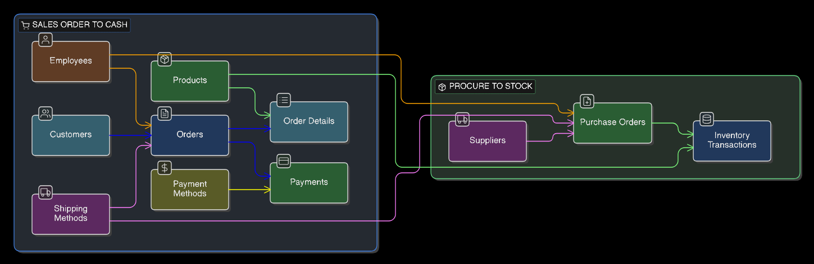
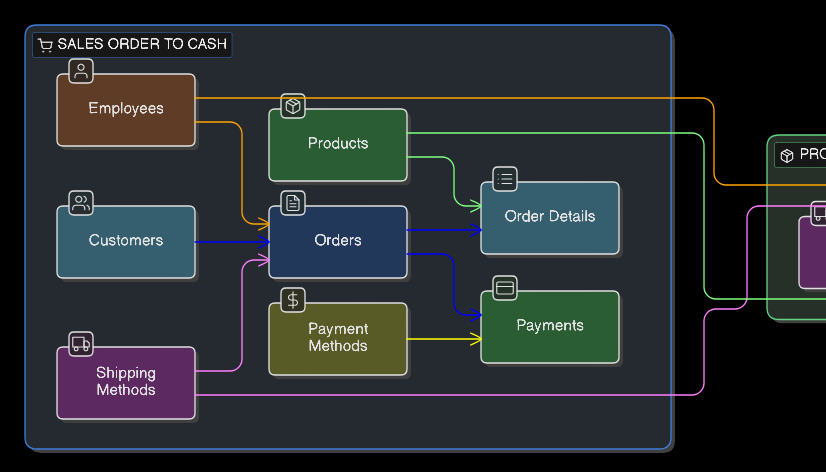
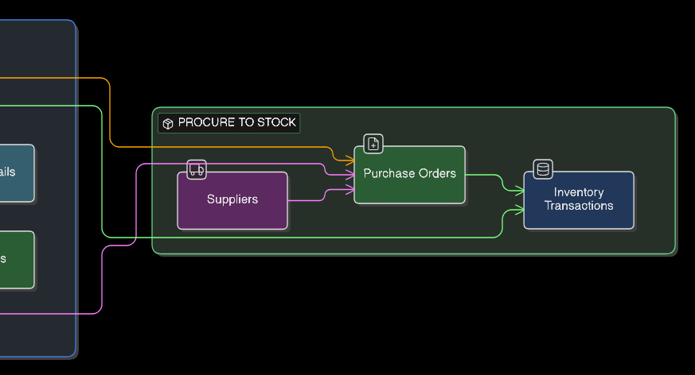
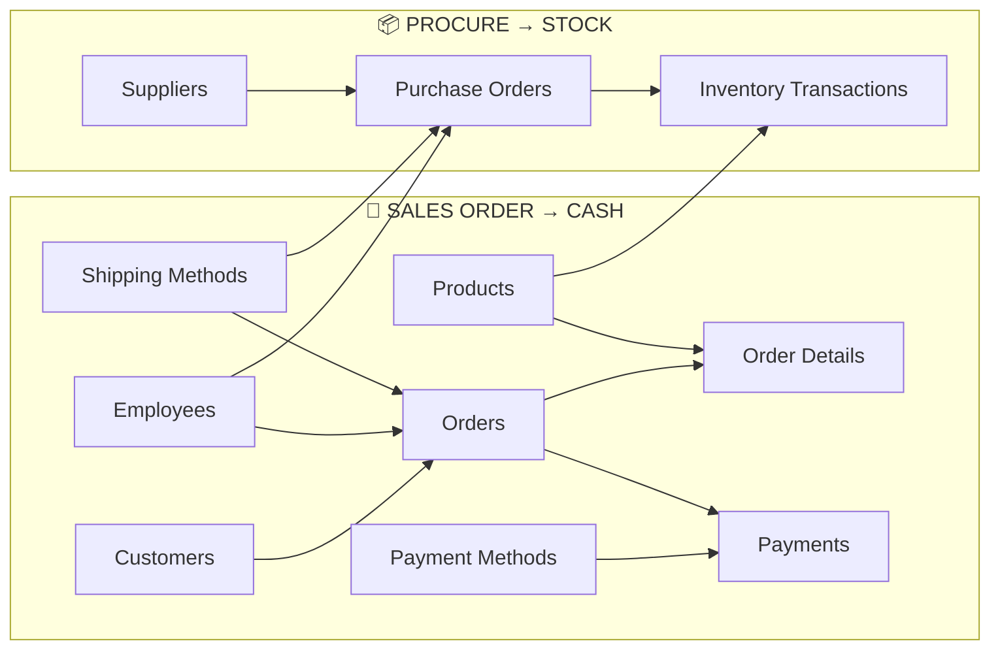

# Flowchart & Lineage (Mermaid) — Underwear Dataset (11 tables)

This document provides a **business-flow view** of the Kaggle “Underwear” dataset, complementing the ER diagram:
- **ER** = “tables + keys” (structural truth)
- **Flowchart** = “process + data movement” (functional story)

Files referenced here (repo paths):
- Full flowchart image: `artifacts/diagrams/flowchart_full.png`
- Left (Sales) zoom: `artifacts/diagrams/flowchart_A.png`
- Right (Procure) zoom: `artifacts/diagrams/flowchart_B.png`

---

## 1) Visual Preview

### Full flowchart (overview)

### A) Sales Order-to-Cash (left side)

### B) Procure-to-Stock (right side)

---

## 2) Mermaid Flowchart (Copy/Paste into mermaid.live)

> This is a **functional lineage diagram** (not a full ER clone).  
> It focuses on “who feeds who” in the business process.

---

## 3) How to Read This Flowchart

### “Left side” (Sales Order → Cash)
- **Orders** is the header / transactional anchor (grain: 1 row per order)
- **Order Details** is the line-level detail (grain: 1 row per item line)
- **Payments** is payment events per order (could be 0..n payments per order)
- **Customers / Employees / Shipping Methods** are the lookup/driver tables for `orders`

### “Right side” (Procure → Stock)
- **Purchase Orders** is the procurement header (grain: 1 row per PO)
- **Inventory Transactions** is the stock movement / receiving / missing tracking (grain: 1 row per transaction)
- **Suppliers / Employees / Shipping Methods** drive procurement headers
- **Products** participates in both worlds (sales lines + inventory transactions)

---

## 4) FA-Relevant “Reality Checks” (Where Data Can Break)

The dataset shows **high-impact FK-orphan buckets** (used in scorecard + recon):
- **Bucket A:** `orders.shipping_method_id → shipping_methods.shipping_method_id`  
  Impact: almost all orders lose their shipping-method meaning (shipping SLA / cost / routing becomes unreliable)
- **Bucket B:** `payments.payment_method_id → payment_methods.payment_method_id`  
  Impact: payment channels become untrusted (card/cash/bank transfer breakdown is wrong)
- **Bucket C:** `inventory_transactions.purchase_order_id → purchase_orders.purchase_order_id`  
  Impact: receiving/stock movements cannot be reconciled to procurement headers (PO lifecycle breaks)

Why the flowchart helps FA:
- It shows **which downstream metrics will be corrupted** if a link breaks (e.g., “shipping method mix”, “payment channel mix”, “PO receiving completeness”)
- It helps communicate to DE/owners **what to fix first** (high-severity broken edges)

---

## 5) Optional Notes for Future Enhancements (Keep It Lean)

If you later add a cleaned-data “extra”:
- You can keep this exact diagram, but add a tiny note:
  - `raw_*` → cleaned → `stg_*` (views)
- The business-flow stays stable; only the “data prep layer” changes.
